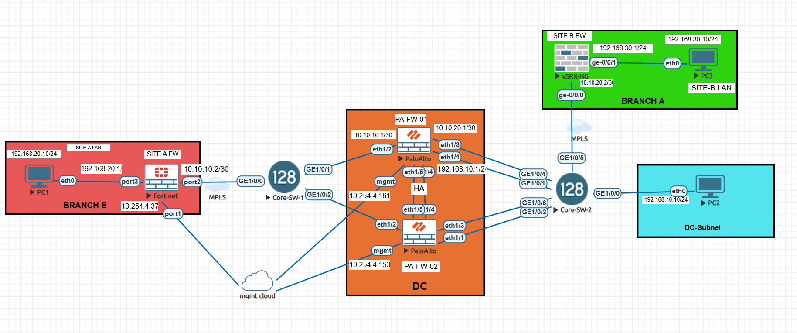

# Multi-Vendor Enterprise Security Lab

Multi-vendor enterprise network lab in EVE-NG: Palo Alto Active/Passive HA, FortiGate and Juniper
vSRX edge firewalls, Huawei CE12800 switching, route-based IPsec VPN with a BGP overlay.



---

## Overview

The lab models a small enterprise with a data centre and two remote sites, each protected by a
different vendor's firewall. It exists to validate four things that matter in real enterprise
networks: firewall resilience, multi-vendor IPsec interoperability, dynamic routing over VPN, and
transit switching tuned for firewall-facing ports.

| Site | Role | Firewall | LAN |
|---|---|---|---|
| Data centre | Core | Palo Alto HA pair (PA-FW-01 / PA-FW-02) | 192.168.10.0/24 |
| Remote site A | Branch | FortiGate | 192.168.20.0/24 |
| Remote site B | Branch | Juniper vSRX | 192.168.30.0/24 |

Full build, verification and test procedure: **[docs/SOP.pdf](docs/SOP.pdf)**

---

## Platforms

| Device | Platform | Software |
|---|---|---|
| PA-FW-01 / PA-FW-02 | Palo Alto PA-VM | PAN-OS 8.1.0, content 769-4439 |
| FortiGate | FortiGate VM | FortiOS 7.6.2 build 3462 |
| vSRX-NG | Juniper vSRX | Junos 24.4R1.9 |
| Core-SW-1 / Core-SW-2 | Huawei CE12800 | VRP V200R005C10SPC607B607 |

---

## Addressing

### LAN segments

| Segment | Subnet | Gateway |
|---|---|---|
| Data centre LAN | 192.168.10.0/24 | Palo Alto ethernet1/1, 192.168.10.1 |
| FortiGate site LAN | 192.168.20.0/24 | FortiGate port3, 192.168.20.1 |
| vSRX site LAN | 192.168.30.0/24 | vSRX ge-0/0/1.0, 192.168.30.1 |

### Transit links and VLANs

| Link | Subnet | Switch and VLAN |
|---|---|---|
| Palo Alto to FortiGate | 10.10.10.0/30 | Core-SW-1, VLAN 20 (`FA-PA`) |
| Palo Alto to vSRX | 10.10.20.0/30 | Core-SW-2, VLAN 30 (`pa-srx`) |
| Data centre LAN | 192.168.10.0/24 | Core-SW-2, VLAN 10 (`pa-lan`) |

### Overlay tunnels

| Tunnel | Palo Alto side | Peer side |
|---|---|---|
| To FortiGate (`VPN1`) | tunnel.1, 172.24.10.1/30 | FortiGate `VPN1` |
| To vSRX (`SRXVPN`) | tunnel.2, 172.16.1.1/30 | vSRX st0.0, 172.16.1.2/30 |

### HA links

| Link | Interface | PA-FW-01 | PA-FW-02 |
|---|---|---|---|
| HA1 control | ethernet1/4 | 10.1.1.1/30 | 10.1.1.2/30 |
| HA2 data | ethernet1/5 | 10.2.2.1/30 | 10.2.2.2/30 |

### BGP

| Device | AS | Router ID | Advertises |
|---|---|---|---|
| Palo Alto | 65001 | 1.1.1.1 | 192.168.10.0/24 |
| FortiGate | 65000 | 2.2.2.2 | 192.168.20.0/24 |
| vSRX | 65003 | — | 192.168.30.0/24 |

---

## Design notes

**Palo Alto HA.** Active/Passive, group ID 1, with PA-FW-01 at device priority 50 and PA-FW-02 at
100. In PAN-OS the lower value is preferred, so PA-FW-01 is the active unit. Preemption is enabled
with a one-minute hold interval, HA1 control and HA2 data run on dedicated direct links, and the
link monitoring group covers ethernet1/1 to ethernet1/5 with failure condition `any`.

**Route-based IPsec.** Both tunnels use IKEv2 with pre-shared keys and 0.0.0.0/0 proxy IDs and
traffic selectors, so routing decides what is encrypted. Policy-based tunnels could not carry a
routing adjacency, which is why route-based is required here.

**BGP over the overlay.** Each site advertises its own LAN prefix; no static inter-site routing.
The Palo Alto redistributes the data centre LAN through a connected redistribution profile on
ethernet1/1 and applies an export policy toward the FortiGate peer group.

**Switching.** Both CE12800s run pure Layer 2. Firewall-facing ports have STP disabled, since they
cannot form a loop and do not need the listening and learning delay.

---

## Validation status

| Area | Result |
|---|---|
| Palo Alto HA cluster and failover test | Working, including preemption back to the preferred unit |
| Palo Alto to vSRX IPsec tunnel | Established, bidirectional traffic confirmed |
| Palo Alto to FortiGate IPsec tunnel | Established |
| Palo Alto to vSRX BGP | Established, prefixes exchanged both ways |
| Palo Alto to FortiGate BGP | Not established — see below |
| End-to-end host testing | Outstanding |

### Open issue: FortiGate to Palo Alto BGP

The FortiGate neighbour sits in `Active` state and never establishes; the Palo Alto peer shows
`Connect` with 66 flaps and zero establishments. The cause is visible in the FortiGate
configuration: the `VPN1` tunnel interface is created as a tunnel bound to port2 with **no IP
address**, while BGP uses that same interface as its update source. With no address there is no
source for the TCP session on port 179 and no route to the peer at 172.24.10.1.

```
config system interface
    edit "VPN1"
        set ip 172.24.10.2 255.255.255.252
        set remote-ip 172.24.10.1 255.255.255.252
    next
end
```

A static route for 192.168.20.0/24 via tunnel.1 on the Palo Alto currently masks the fault, since
traffic to the FortiGate LAN still flows and a simple ping test passes. Full analysis is in the SOP.

---

## Repository structure

```text
.
├── README.md
├── configs/          # Device configuration exports (secrets redacted)
├── docs/             # SOP — full build, verification and test procedure
└── topology/         # Topology diagram and EVE-NG lab export
```

---

## Building the lab

1. Install EVE-NG and upload the Palo Alto VM-Series, FortiGate, vSRX and Huawei CE12800 images to
   `/opt/unetlab/addons/qemu/`, then run `/opt/unetlab/wrappers/unl_wrapper -a fixpermissions`.
2. Import the lab from `topology/` and start the nodes: switches first, then firewalls, then hosts.
3. Apply the switch configurations so Layer 2 transit is up before the firewalls come online.
4. Build the Palo Alto HA pair and confirm the cluster forms before adding anything else.
5. Apply interface, zone and policy configuration, then verify each /30 transit link with ping.
6. Build the IPsec tunnels, then the BGP peerings on top of them.
7. Work through the verification and failover procedures in the SOP.

Each step, with the exact commands per platform, is in [docs/SOP.pdf](docs/SOP.pdf).

---

## Notes

- Pre-shared keys, password hashes and the device serial number are redacted from the committed
  configurations.
- The IKE and IPsec proposals in this build use DES, which is deprecated and suitable only for a
  laboratory. Move to AES-256-GCM or AES-256-CBC with SHA-256 before adapting any of this elsewhere.
- The Palo Alto rulebase includes a permissive `any-any` rule, and the vSRX uses default-permit
  policies. Both are deliberate here so the lab focuses on routing and HA behaviour rather than
  policy enforcement.

---

Built and verified in EVE-NG. Issues and suggestions are welcome.
